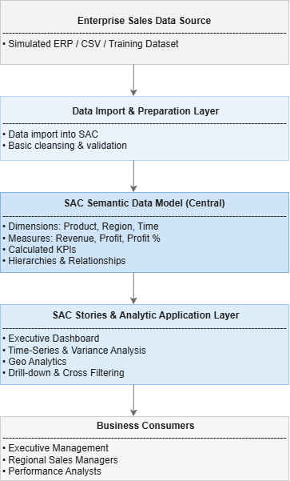
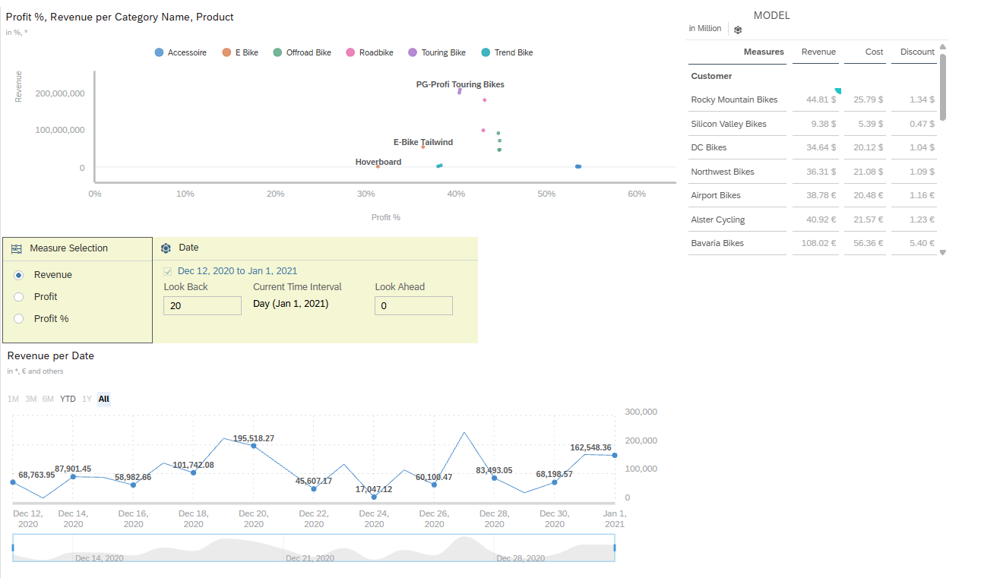
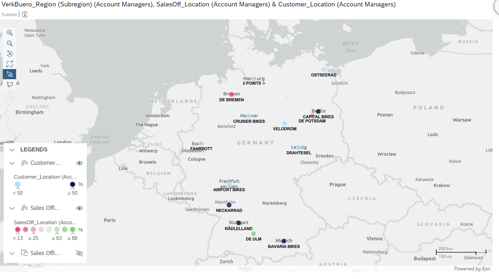

# 01 — Sales Performance Analytics  
SAP Analytics Cloud (Model-Based Implementation)

## Business Objective

Design and implement an executive-level Sales Performance Analytics solution in SAP Analytics Cloud using a structured data model.

The objective was to provide interactive KPI transparency across regions, product groups, and time periods while enabling dynamic drill-down and performance monitoring.

The solution addresses common enterprise reporting challenges:

- Fragmented reporting across departments  
- Manual spreadsheet-based KPI tracking  
- Limited drill-down capabilities  
- Lack of standardized KPI visualization  

---

## Architecture Overview

### Conceptual Flow

Enterprise Dataset (Imported into SAC Model)  
→ SAC Data Model  
→ SAC Stories & Analytic Application  
→ Business Users (Sales & Management)

The solution demonstrates a structured SAC model-based reporting architecture where analytics are built on a governed data model within SAP Analytics Cloud.

---

## Solution Scope

The implemented solution includes:

- Executive KPI overview dashboard  
- Revenue and profit performance monitoring  
- Regional comparison (e.g., Germany & USA)  
- Conditional KPI highlighting  
- Time-series analysis and variance comparison  
- Geographic visualization of sales distribution  
- Interactive analytic application for enhanced exploration  

---

## KPI Framework

Core KPIs implemented:

- Revenue  
- Profit  
- Profit %  
- Regional performance contribution  
- Time-based performance comparison  

Conditional formatting was applied to highlight:

- Underperforming regions  
- KPI threshold deviations  
- Significant positive or negative variances  

This enables fast management-level interpretation.

---

## Advanced Story Capabilities Implemented

- Time-series comparison and period analysis  
- Ranking and contribution analysis  
- Dynamic calculations within stories  
- Advanced filtering (product, region, time)  
- Cross-chart filtering interactions  
- Drill-down from aggregated to detailed levels  

These capabilities extend the solution beyond static reporting into interactive analytics.

---

## Dashboard Evidence

### Executive Performance Overview

Aggregated KPI visibility designed for management consumption.

---

### Conditional KPI Monitoring

Threshold-based visual cues for performance monitoring.

---

### Geographic Sales Analysis

Geo mapping for spatial sales performance analysis.

---

### Analytic Application Layer

Enhanced interaction layer providing:

- Advanced filtering controls  
- Dynamic user-driven analysis  
- Interactive regional exploration  

---

## Technical Implementation Summary

- Data model created within SAP Analytics Cloud  
- Structured dimensions (Product, Region, Time, Customer)  
- KPI measures defined and validated  
- Conditional formatting rules configured  
- Time-series and comparison charts implemented  
- Geographic dimension enabled  
- Analytic Application created for interactive analysis  

---

## Design Principles Applied

- Separation between data model and presentation layer  
- KPI-driven storytelling  
- Structured filter logic  
- Executive-oriented layout design  
- Interactive drill and cross-filter capability  

---

## Enterprise Value Perspective

- Centralized sales performance visibility  
- Reduced reliance on manual reporting  
- Improved regional performance monitoring  
- Faster identification of performance deviations  
- Reusable reporting blueprint for enterprise analytics  

---

## Skills Demonstrated

- SAP Analytics Cloud Story Design  
- SAC Model configuration  
- KPI modeling and validation  
- Conditional formatting and threshold logic  
- Time-series and ranking analysis  
- Geo analytics configuration  
- Analytic Application development  
- Executive-level dashboard architecture  
