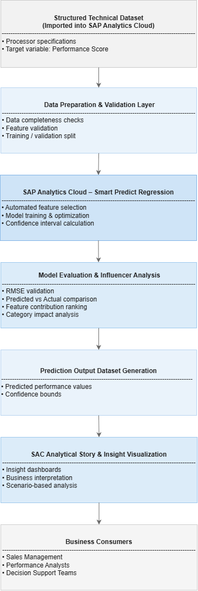
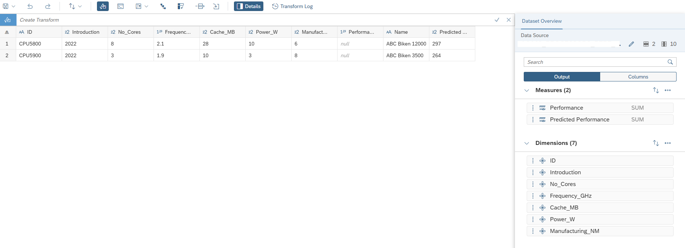
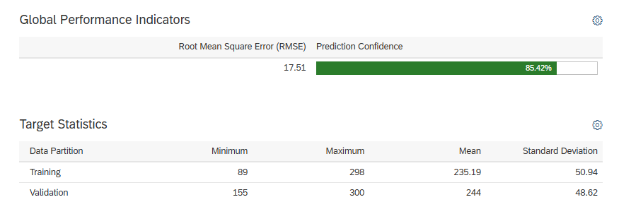
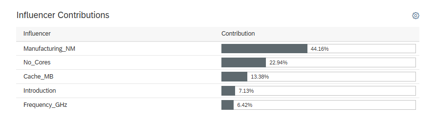
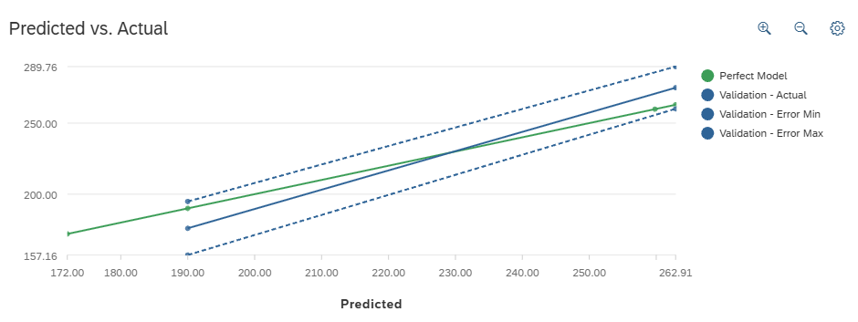
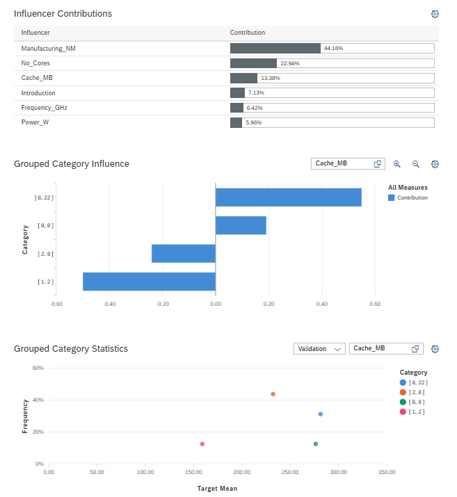

# 02 — Predictive Analytics (Regression Model)  
SAP Analytics Cloud – Smart Predict Implementation

## Business Objective

Design and implement a regression-based predictive analytics solution using SAP Analytics Cloud (Smart Predict) to estimate processor performance based on technical specifications.

The objective was to:

- Identify key performance drivers  
- Generate reliable predictive output  
- Validate model accuracy  
- Provide business-interpretable insights  
- Translate statistical output into actionable analysis  

This implementation reflects how predictive analytics can complement traditional reporting within enterprise analytics environments.

---

## Architecture Overview

### Predictive Workflow Architecture

**End-to-End Flow:**

Structured Technical Dataset (Imported into SAP Analytics Cloud)  
→ Data Preparation & Validation  
→ Smart Predict Regression Model  
→ Model Evaluation & Influencer Analysis  
→ Prediction Output Dataset  
→ SAC Analytical Story  
→ Business Consumers  

The solution demonstrates a layered predictive workflow within SAP Analytics Cloud. 

The architecture separates data preparation, model training, evaluation, output generation, and reporting consumption to ensure transparency and structured integration of predictive insights into the analytics layer.

---

## Dataset Structure

The dataset contains processor specifications used as predictive variables.

Predictor variables:
- Number of Cores  
- Frequency (GHz)  
- Cache Size (MB)  
- Power Consumption (W)  
- Manufacturing Process (nm)  
- Introduction Year  

Target variable:
- Performance Score  

---

## Model Training & Evaluation

A regression scenario was configured in Smart Predict to model the relationship between technical characteristics and performance output.

Evaluation metrics included:

- Root Mean Square Error (RMSE)  
- Validation accuracy comparison  
- Prediction confidence intervals  

The model demonstrated strong validation consistency and acceptable error margins.

---

## Influencer Analysis

Smart Predict provides feature contribution analysis to identify variable importance.

Key influencing factors:

- Manufacturing Process  
- Number of Cores  
- Cache Size  
- Frequency  
- Introduction Year  

This enables interpretability and business-level explanation of predictive outcomes.

---

## Predicted vs Actual Comparison

Validation analysis compares:

- Perfect model line  
- Predicted values  
- Actual validation values  
- Error boundaries  

This confirms model reliability and predictive stability.

---

## Feature Category Impact

Grouped analysis was performed to evaluate performance variation across feature ranges.

This supports scenario-based interpretation and segmentation-level insight.

---

## Technical Implementation Summary

- Dataset imported into SAP Analytics Cloud  
- Regression scenario configured in Smart Predict  
- Training and validation split executed  
- Model performance evaluated using RMSE and confidence intervals  
- Influencer analysis reviewed for interpretability  
- Prediction dataset generated  
- Results visualized in analytical story  

---

## Design Principles Applied

- Clear separation between dataset and predictive model  
- Transparent model evaluation  
- Feature interpretability for business explanation  
- Validation-based performance confirmation  
- Integration of predictive output into reporting layer  

---

## Enterprise Value Perspective

- Enables data-driven forecasting  
- Identifies high-impact technical drivers  
- Improves interpretability of performance determinants  
- Demonstrates integration of predictive modeling into analytics workflows  
- Serves as blueprint for predictive use cases in enterprise environments  

---

## Skills Demonstrated

- SAP Analytics Cloud Smart Predict configuration  
- Regression modeling  
- Model evaluation and validation  
- Influencer analysis interpretation  
- Prediction output generation  
- Analytical storytelling of predictive results  
- End-to-end predictive workflow implementation  

