# 03 — Integrated Planning & Forecasting  
SAP Analytics Cloud – Enterprise Planning Implementation

## Business Objective

Design and implement an integrated enterprise planning solution using **SAP Analytics Cloud (Planning)** combining **Sales Planning**, **Cost Center (CO) Planning**, **predictive time-series forecasting**, and **governance controls**.

The objective was to:

- Integrate Sales and CO planning models  
- Automate planning logic using Data Actions and Allocations  
- Implement predictive time-series forecasting  
- Establish governance via validation and data locking  
- Deliver executive-level reporting and simulation capabilities  

This implementation reflects how SAC planning can combine operational planning, forecasting, governance, and storytelling in one end-to-end workflow.

---

## Architecture Overview

### End-to-End Planning Workflow

Data Sources (Historical Sales & CO, Master Data, Currency Rates)  
→ SAC Planning Model Layer (Sales + CO Models)  
→ Planning Logic Layer (Data Actions, Formulas, Allocations, Multi Actions)  
→ Predictive Forecasting (Time Series + Forecast Versions)  
→ Reporting & Consumption (Stories, Version Comparison, Value Driver Tree)  
↔ Governance (Validation Rules, Data Locking, Version Management)

---

## Planning Model Structure

### Sales Planning Model

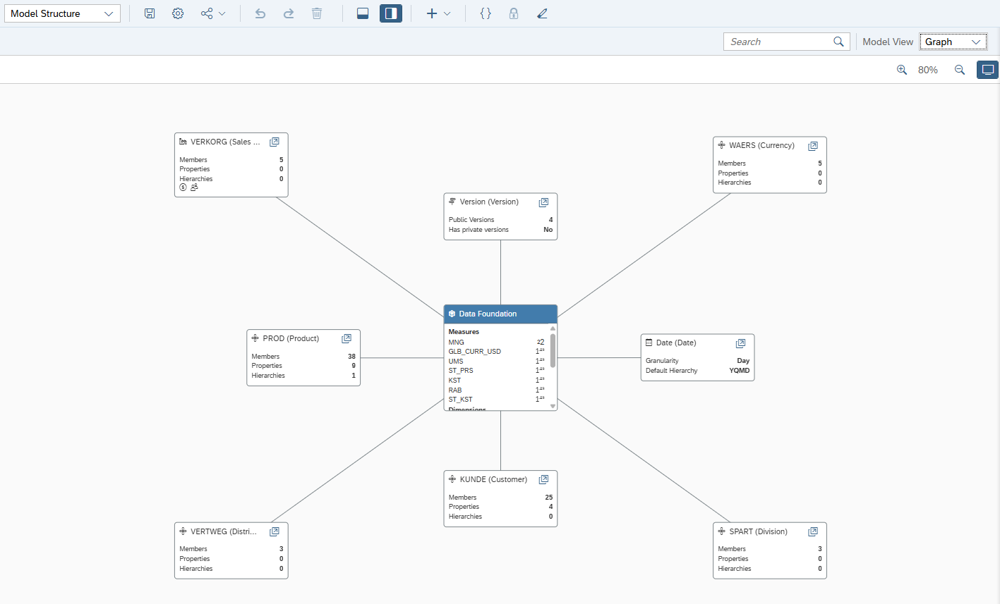

Core characteristics:

- Monthly time granularity  
- Version dimension (Actual, FCV1, FCV2)  
- Product, Customer, Sales Organization dimensions  
- Revenue and Quantity measures  

---

### CO Planning Models

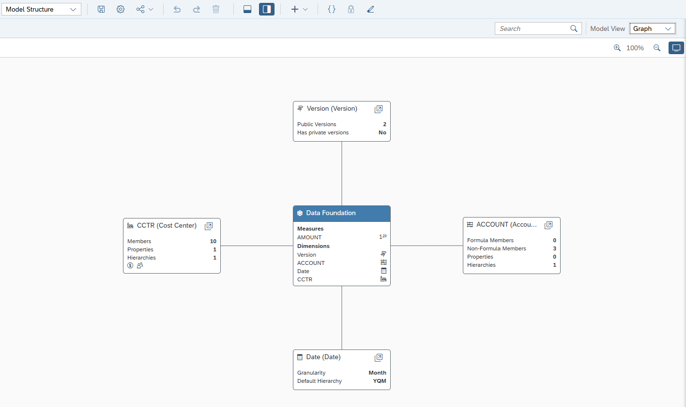  
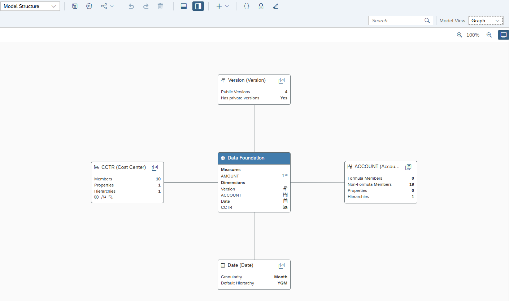

Core characteristics:

- Cost Center dimension  
- Account structure for expense planning  
- Planning-ready model foundation for allocations and calculations  

---

## Version Management

Version setup supports:

- Public vs Forecast versions  
- Scenario comparisons (Actual vs FCV1 vs FCV2)  
- Structured planning cycles and review  

---

## Planning Logic & Automation

### Advanced Formula – Calculation Logic

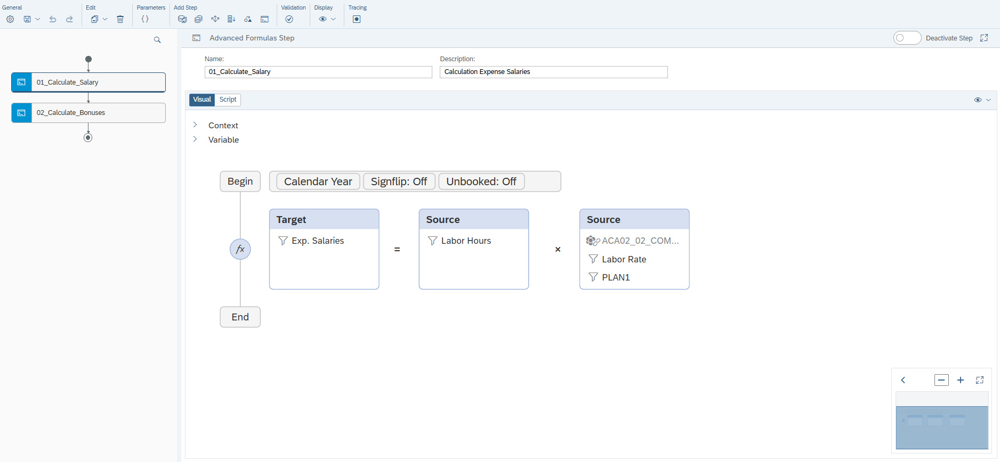

Example calculation logic:

- Expense = Labor Hours × Labor Rate  
- Version-controlled write-back execution  

---

### Cost Allocation

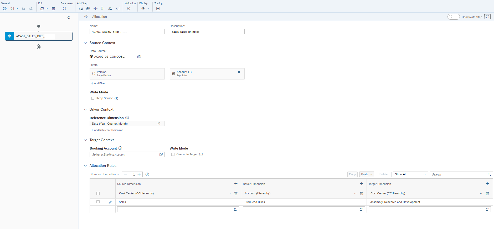

Allocation setup supports:

- Driver-based distribution logic  
- Cost center and account-level allocations  
- Controlled planning adjustments  

---

### Multi Action Orchestration

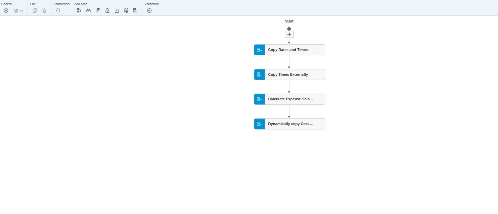

Automated execution chain:

1. Copy data  
2. Execute calculations  
3. Run allocations  
4. Publish results  

---

## Predictive Forecasting

### Forecast Configuration

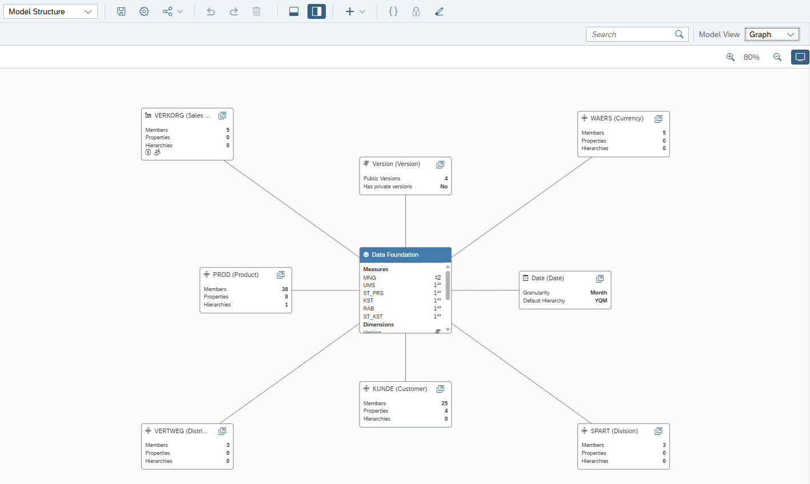

Time-series forecasting setup:

- Monthly granularity  
- Revenue as predictive target  
- Forecast versions created (FCV1, FCV2)  

---

### Predictive Model Performance

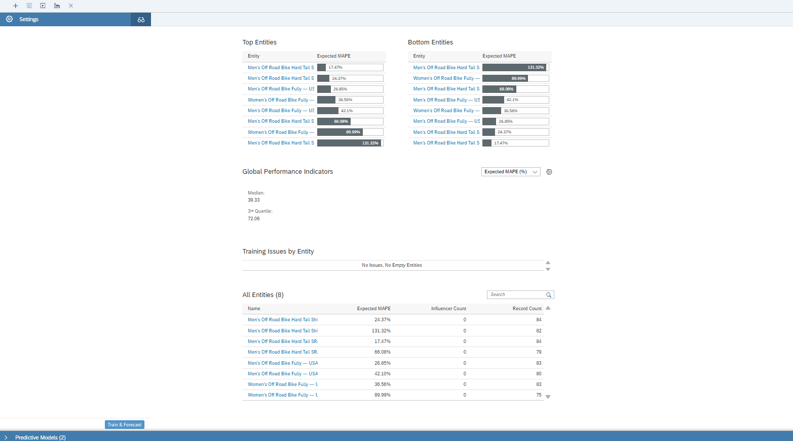

Evaluation highlights:

- MAPE-based validation  
- Entity-level performance comparison  
- Confidence intervals for forecast reliability  

---

### Forecast Story Output

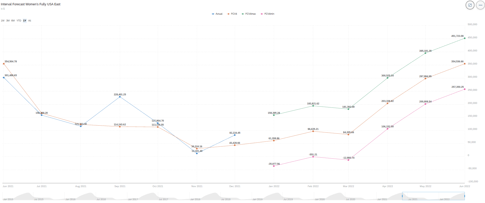

Story output supports:

- Actual vs Forecast comparison  
- Scenario simulation and review  
- Visual confidence/interval interpretation  

---

## Value Driver Simulation

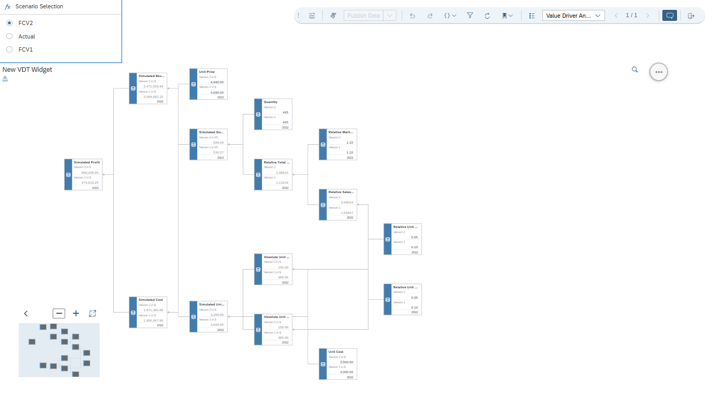

Value Driver Tree enables:

- Revenue driver structure  
- Quantity × Price logic  
- Profit simulation with scenario selection  

---

## Governance Framework

### Validation Rules

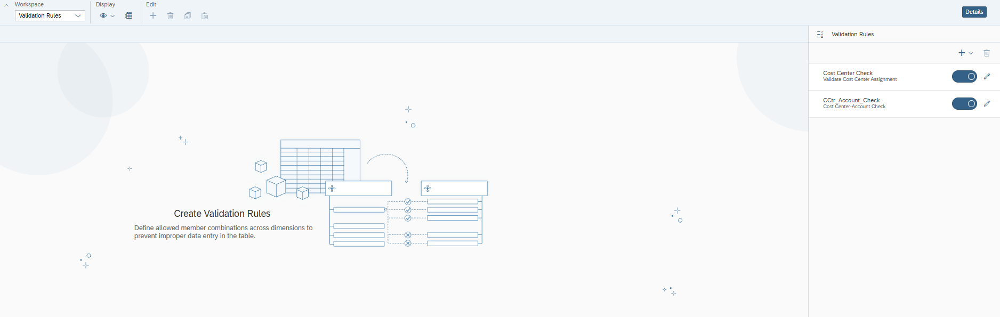

Governance controls include:

- Cost center validation  
- Account assignment checks  
- Controlled input combinations  

---

### Data Locking

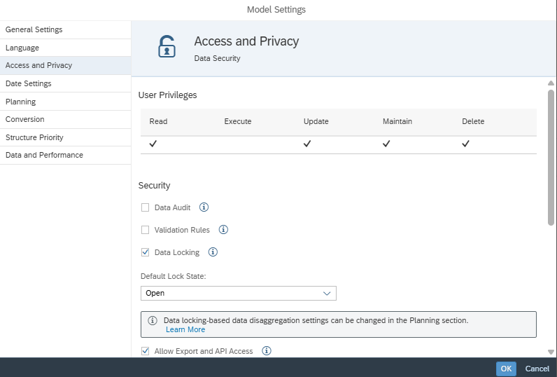

Locking setup supports:

- Model-level locking configuration  
- Controlled submission process  
- Improved planning integrity and audit readiness  

---

## Technical Implementation Summary

- Sales and CO planning models configured  
- Version management structured (Actual + Forecast versions)  
- Advanced formulas implemented for calculations  
- Allocation logic created for driver-based distribution  
- Multi Actions used for automation and orchestration  
- Predictive forecasting configured (time-series)  
- Governance framework applied (validation + locking)  
- Stories developed for reporting and simulation  

---

## Design Principles Applied

- Layered planning architecture (model → logic → forecast → consumption)  
- Repeatable automation via Data Actions and Multi Actions  
- Forecast interpretability through performance metrics and intervals  
- Governance-first design (validation + locking + version control)  
- Business-friendly consumption via Stories and Value Driver Trees  

---

## Enterprise Value Perspective

- Integrates Sales and CO planning in one workflow  
- Reduces manual effort through automation  
- Enhances planning with predictive forecasting  
- Strengthens governance controls and planning integrity  
- Enables executive-level scenario simulation and decision support  

---

## Skills Demonstrated

- SAP Analytics Cloud Planning  
- Model design (Sales + CO)  
- Version management and scenario setup  
- Data Actions and Advanced Formulas  
- Driver-based allocations  
- Multi Action orchestration  
- Predictive time-series forecasting  
- Governance (Validation Rules + Data Locking)  
- Analytical storytelling and simulation design  
