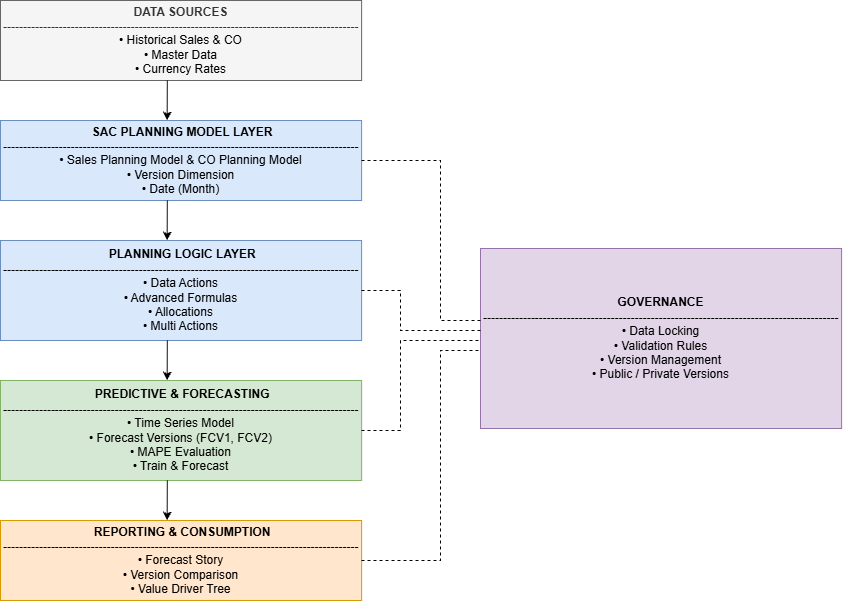

# 03 — Integrated Planning & Forecasting Architecture  
SAP Analytics Cloud – Enterprise Planning Implementation  

## Business Objective

Design and implement an integrated enterprise planning solution using SAP Analytics Cloud (Planning) combining Sales Planning, Cost Center Planning, predictive forecasting, and governance controls.

The objective was to:

- Integrate Sales and CO planning models  
- Automate planning logic using Data Actions and Allocations  
- Implement predictive time-series forecasting  
- Establish governance via validation and data locking  
- Deliver executive-level reporting and simulation capabilities  

This implementation reflects how SAP Analytics Cloud supports structured enterprise planning workflows beyond standalone budgeting exercises.

---

## Architecture Overview

### Integrated Planning Workflow Architecture

Structured Planning Data (Sales & CO Actuals + Master Data)  
→ SAP Analytics Cloud – Planning Models (Sales / CO / Forecast)  
→ Planning Logic Layer (Data Actions, Allocations, Multi Actions)  
→ Predictive Time-Series Forecast  
→ Governance Controls (Versioning, Validation, Data Locking)  
→ SAC Stories & Value Driver Simulation  

The solution demonstrates a multi-layer planning architecture where modeling, automation, forecasting, governance, and reporting are clearly separated yet fully integrated.

The architecture ensures transparency, process automation, version control, and executive-level consumption.

---

## Planning Model Structure

### Sales Planning Model

Core characteristics:

- Monthly time granularity  
- Version dimension (Actual, FCV1, FCV2)  
- Product, Customer, Sales Organization dimensions  
- Measures: Quantity, Revenue, Unit Price  

---

### CO Planning Models

  

Core characteristics:

- Cost Center dimension  
- Account dimension  
- Expense planning logic  
- Allocation-ready structure  

The separation of Sales and CO models reflects enterprise best practice for modular planning architecture.

---

## Planning Logic & Automation

### Advanced Formula – Salary Calculation

Implemented calculation logic:

- Expense = Labor Hours × Labor Rate  
- Version-based execution  
- Structured measure write-back  

---

### Allocation Logic

Driver-based allocation:

- Sales-based distribution  
- Cost Center to Account allocation  
- Period-aware distribution logic  

---

### Multi Action Orchestration

Automated execution chain:

1. Copy Rates & Times  
2. Calculate Expense Salaries  
3. Dynamic Cost Copy  
4. Execute Allocations  

This enables repeatable and structured planning process automation.

---

## Predictive Forecasting

### Predictive Model Configuration

- Time Series Forecasting scenario  
- Monthly granularity  
- Revenue as predictive target  
- Actual version used for training  

---

### Model Evaluation

Evaluation included:

- MAPE (Mean Absolute Percentage Error)  
- Entity-level validation  
- Confidence interval generation  

---

### Forecast Output & Scenario Comparison

- Actual vs Forecast comparison  
- Confidence interval bands  
- Version-based scenario simulation  

---

## Reporting & Simulation Layer

### Version Comparison Story

- Period-over-period comparison  
- FCV1 vs FCV2 evaluation  
- Revenue & Quantity variance analysis  

---

### Value Driver Tree Simulation

Driver-based simulation structure:

- Revenue = Quantity × Price  
- Cost impact analysis  
- Simulated Profit calculation  
- Scenario selection (Actual vs Forecast versions)  

This enables executive-level planning simulation and decision support.

---

## Governance Framework

### Data Locking

- Model-level locking enabled  
- Controlled planning submissions  
- Default lock state configuration  

---

### Validation Rules

- Cost Center validation  
- Account assignment checks  
- Controlled data entry logic  

---

## Technical Implementation Summary

- Separate Sales and CO planning models configured  
- Version dimension structured for forecast comparison  
- Advanced formulas implemented for expense logic  
- Driver-based allocations configured  
- Multi Actions created for process automation  
- Time-series predictive scenario configured  
- Forecast versions generated and compared  
- Governance framework implemented (locking & validation)  
- Analytical stories developed for reporting and simulation  

---

## Design Principles Applied

- Clear separation between model, logic, predictive, and reporting layers  
- Modular planning architecture  
- Automated and repeatable execution logic  
- Governance-controlled data submission  
- Transparent forecast evaluation  
- Executive-oriented storytelling  

---

## Enterprise Value Perspective

- Integrates Sales and CO planning within a unified platform  
- Automates manual planning processes  
- Introduces predictive forecasting into budgeting workflow  
- Enhances governance and data control  
- Enables scenario-based executive decision support  
- Demonstrates scalable enterprise planning architecture  

---

## Skills Demonstrated

- SAP Analytics Cloud Planning configuration  
- Multi-model planning architecture design  
- Advanced Formula development  
- Driver-based allocation setup  
- Multi Action orchestration  
- Predictive time-series configuration  
- Governance framework implementation  
- Executive reporting & Value Driver Tree simulation  
- End-to-end enterprise planning workflow delivery  

