# 04 — BW/4HANA Enterprise Data Foundation  
SAP BW/4HANA – Layered Enterprise Data Warehouse Architecture  

---

## Business Objective

Design and implement a structured enterprise data warehouse solution using SAP BW/4HANA, integrating SAP ERP (CO module) data into a harmonized analytical model for Plan vs Actual cost analysis.

The objective was to:

- Extract and stage SAP ERP CO data  
- Model harmonized InfoObjects and Key Figures  
- Separate staging and core warehouse layers  
- Enable Plan vs Actual comparison  
- Provide semantic modeling via CompositeProvider  
- Deliver BW Queries for reporting  
- Expose data to SAP Analytics Cloud for visualization  

This implementation reflects a classical layered enterprise data warehouse architecture built on SAP BW/4HANA principles.

---

## Architecture Overview

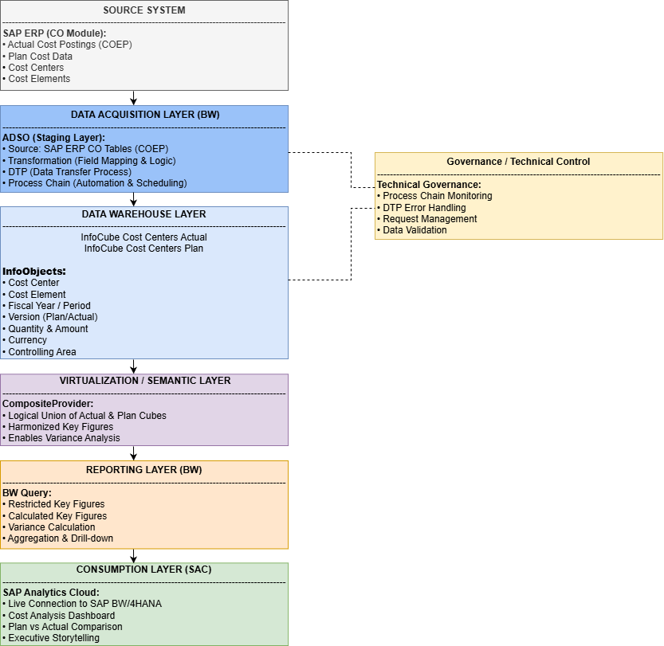

### Layered Enterprise Data Foundation Architecture

SAP ERP (CO Module)  
→ BW Staging Layer (ADSO)  
→ Core Data Warehouse Layer (InfoCubes / Core ADSO)  
→ Semantic Layer (CompositeProvider)  
→ BW Query Layer  
→ SAP Analytics Cloud (Live Connection)  

The architecture separates acquisition, modeling, semantic harmonization, reporting, and consumption layers, ensuring scalability, governance, and maintainability.

---

## Source System Layer

### SAP ERP – Controlling (CO Module)

Source data includes:

- Actual Cost Postings (COEP)
- Plan Cost Data
- Cost Centers
- Cost Elements
- Fiscal Year / Period
- Version (Plan / Actual)

---

## Data Acquisition Layer (BW)

### ADSO – Staging Layer

Responsible for:

- Extracting SAP ERP CO tables  
- Field mapping via Transformation  
- DTP execution  
- Automated scheduling via Process Chain  

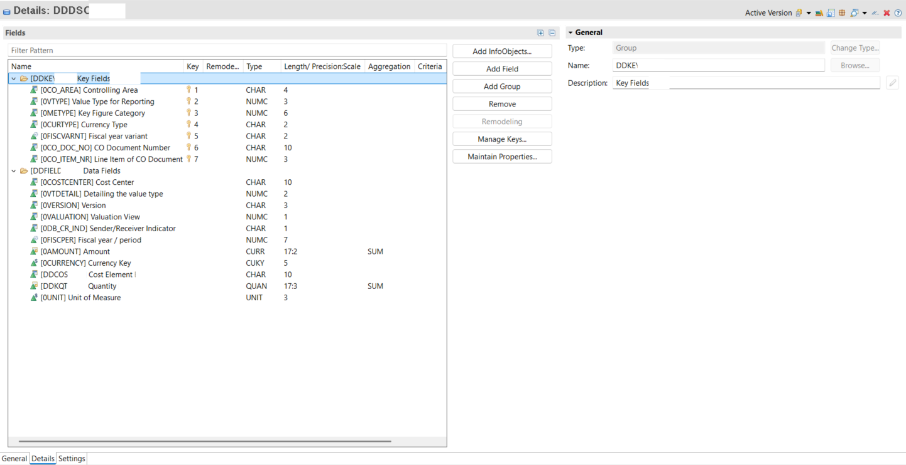

---

## Core Data Warehouse Layer

### Core InfoProviders

- InfoCube Cost Centers Actual  
- InfoCube Cost Centers Plan  

Modeled using harmonized InfoObjects:

- Cost Center  
- Cost Element  
- Fiscal Year / Period  
- Version (Plan / Actual)  
- Currency  
- Controlling Area  
- Key Figures (Amount, Quantity)

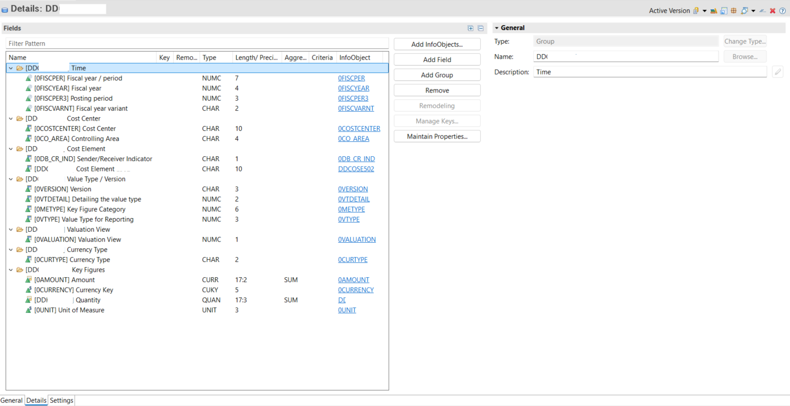

---

## InfoObjects Design

### Characteristic Example

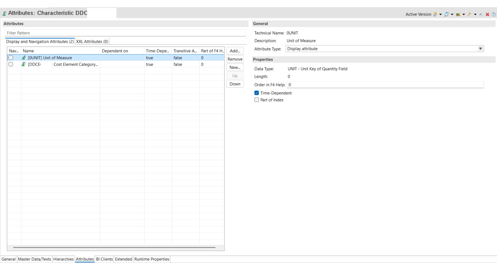

### Key Figure Example

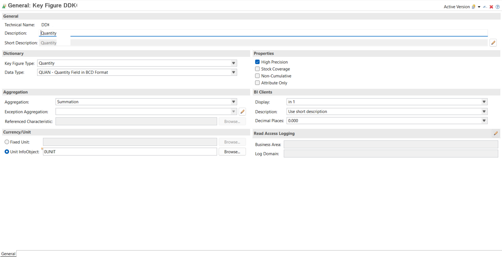

Reusable InfoObjects ensure semantic consistency across models.

---

## Transformation & Data Flow

### Field Mapping Logic

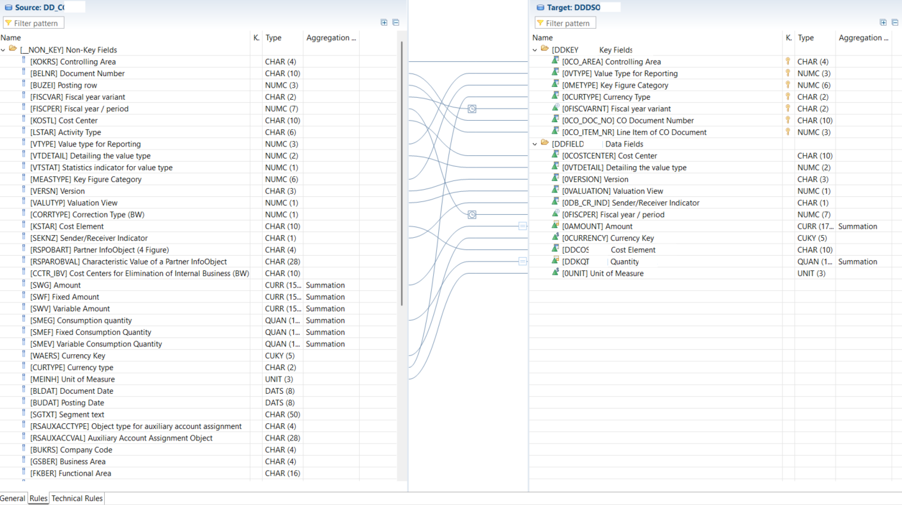

### DTP Execution Monitoring

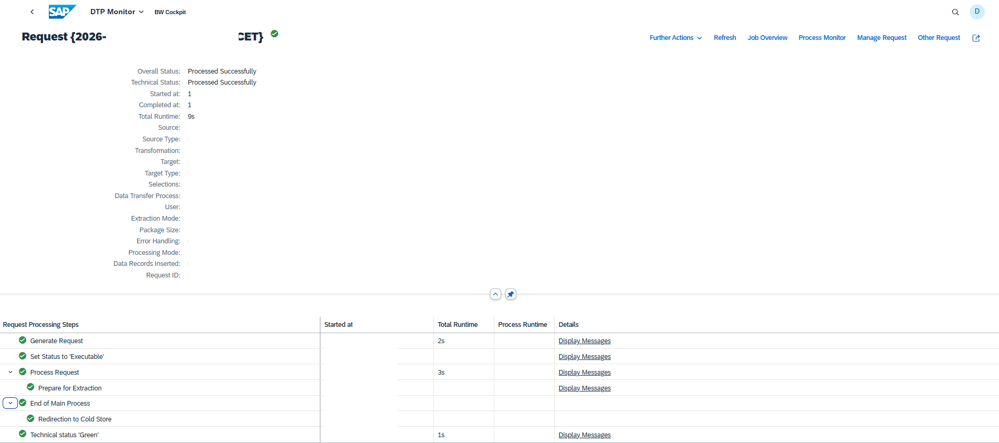

---

## Core Data Validation

### Data Preview in Core ADSO

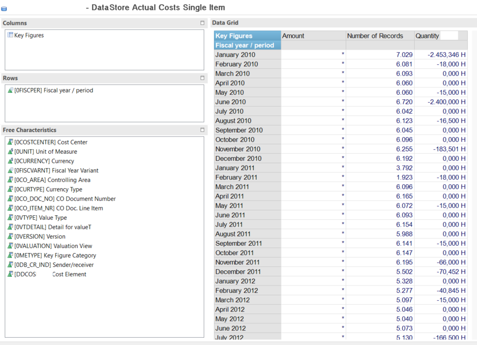

### Request-Level Data Validation

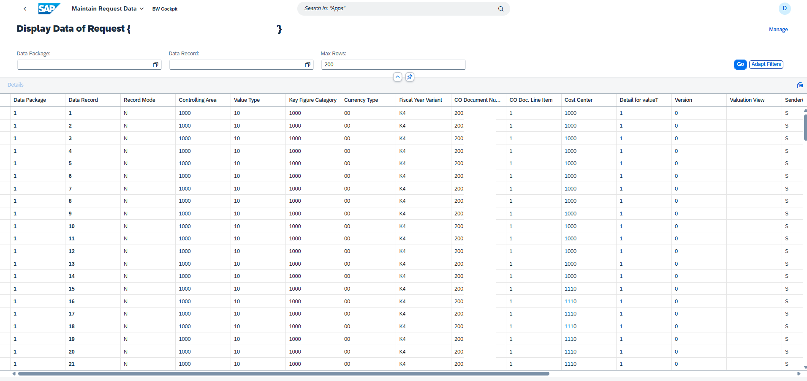

Ensures technical and business-level validation of loaded data.

---

## Virtualization / Semantic Layer

### CompositeProvider Modeling

Combines:

- Actual Cube  
- Plan Cube  

Enables:

- Logical union  
- Harmonized key figures  
- Variance-ready reporting structure  

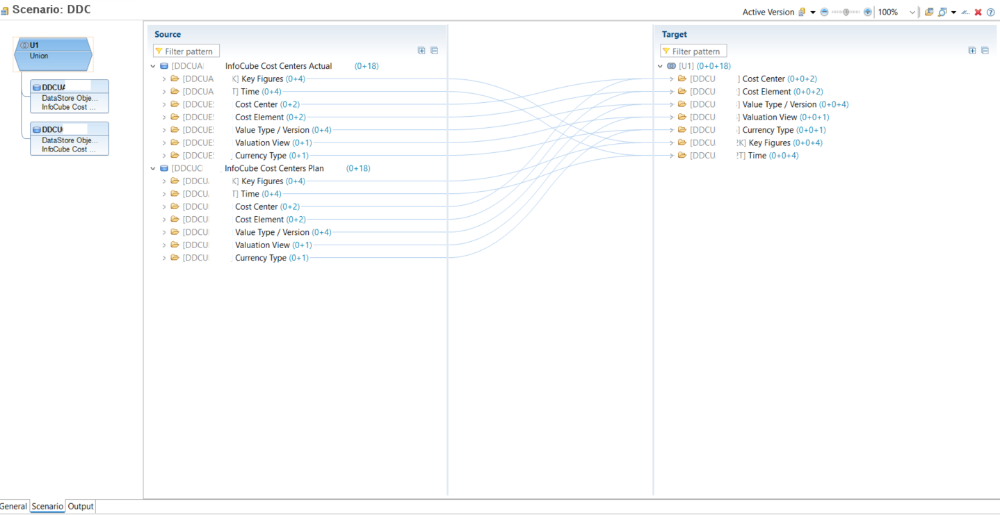

---

## Reporting Layer (BW)

### BW Query Design

Includes:

- Restricted Key Figures  
- Calculated Key Figures  
- Variance Calculation  
- Aggregation & Drill-down  

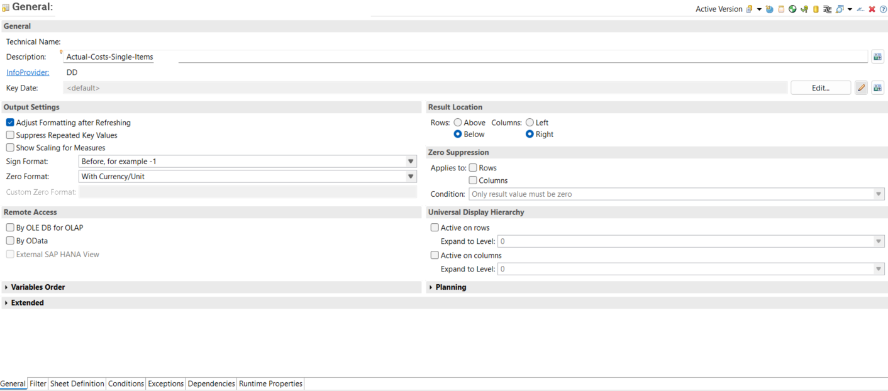

---

## Consumption Layer (SAP Analytics Cloud)

Live connection to SAP BW/4HANA enables:

- Cost Analysis Dashboard  
- Plan vs Actual Comparison  
- Executive Storytelling  

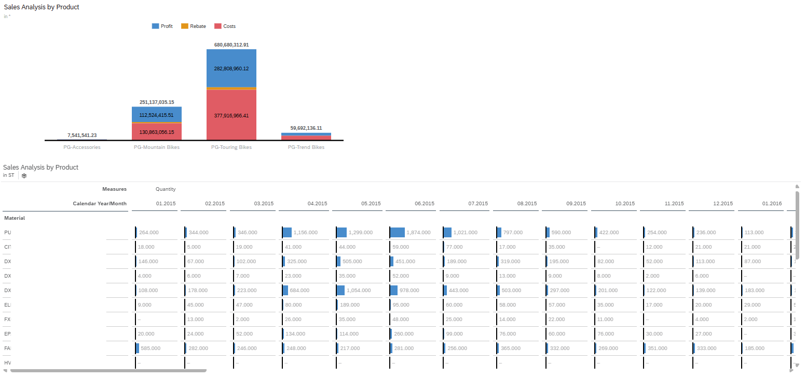

---

## Technical Governance

Technical controls implemented:

- Process Chain Monitoring  
- DTP Error Handling  
- Request Management  
- Data Validation  
- Structured Layer Separation  

Ensures enterprise-grade stability and auditability.

---

## Technical Implementation Summary

- SAP ERP CO data extraction  
- ADSO staging layer design  
- Transformation & DTP configuration  
- Core InfoCube modeling (Plan & Actual)  
- CompositeProvider semantic modeling  
- BW Query variance calculation  
- SAC Live reporting integration  

---

## Design Principles Applied

- Layered architecture separation  
- Reusable InfoObjects  
- Clear staging vs core modeling  
- Semantic harmonization via CompositeProvider  
- Variance-ready query modeling  
- Live analytics consumption  

---

## Enterprise Value Perspective

- Structured enterprise data foundation  
- Financial transparency across planning & actuals  
- Plan vs Actual governance capability  
- Scalable BW/4HANA modeling approach  
- Enterprise-ready data architecture blueprint  

---

## Skills Demonstrated

- SAP BW/4HANA Modeling  
- ADSO & InfoCube Design  
- Transformation & DTP Configuration  
- CompositeProvider Modeling  
- BW Query Development  
- Plan vs Actual Variance Logic  
- SAP Analytics Cloud Live Integration  
- Enterprise Data Warehouse Architecture Design  
