# 05 — BW/4HANA to SAP Datasphere Integration  
SAP BW/4HANA – Hybrid On-Prem & Cloud Analytics Architecture

---

## Business Objective

Design and implement a hybrid enterprise analytics architecture integrating **SAP BW/4HANA** with **SAP Datasphere**, enabling cloud-based semantic modeling while preserving a governed on-premise enterprise data warehouse foundation.

The objective was to:

- Extract delta-enabled sales data from SAP S/4HANA  
- Implement LSA++ layered modeling in BW/4HANA  
- Model harmonized InfoObjects and reporting ADSOs  
- Build CompositeProvider for semantic unification  
- Create SAP HANA Calculation View (Star Join)  
- Replicate BW data into SAP Datasphere  
- Build Fact and Dimension Views in Datasphere  
- Deliver an Analytic Model for cloud analytics  

This implementation demonstrates a **hybrid enterprise data architecture** combining BW governance with modern cloud analytics modeling.

---

## Architecture Overview

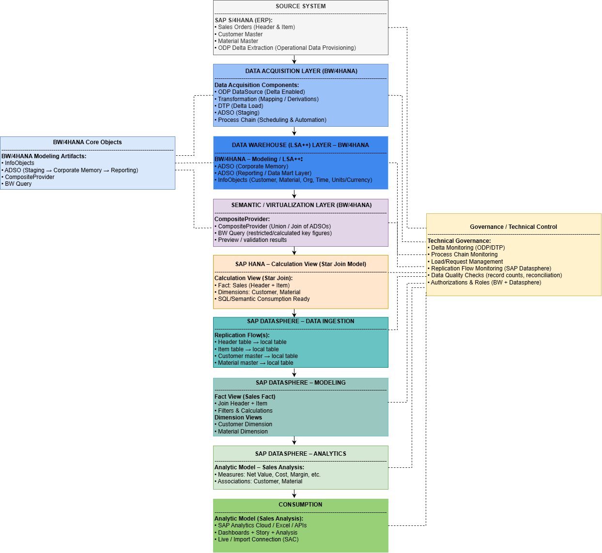

### Hybrid Architecture Flow

SAP S/4HANA  
→ BW/4HANA Data Acquisition Layer  
→ LSA++ Data Warehouse Layer  
→ CompositeProvider (Semantic Layer)  
→ SAP HANA Calculation View (Star Join)  
→ SAP Datasphere Replication Flow  
→ Datasphere Fact & Dimension Modeling  
→ Analytic Model  
→ SAP Analytics Cloud  

---

## Source System Layer

### SAP S/4HANA – Sales Data

Source objects include:

- Sales Order Header  
- Sales Order Item  
- Customer Master  
- Material Master  
- ODP Delta Extraction (Operational Data Provisioning)

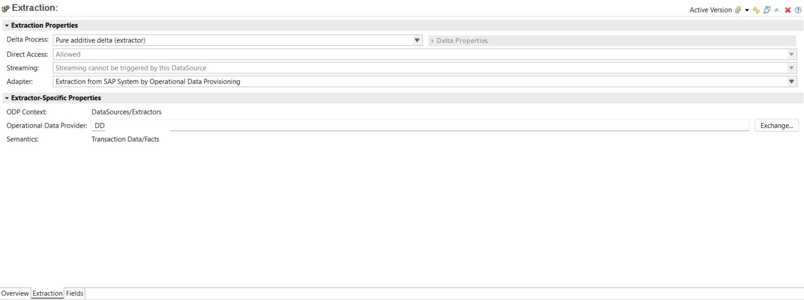

---

## Data Acquisition Layer (BW/4HANA)

### ADSO – Staging Layer

Responsible for:

- ODP DataSource (Delta Enabled)  
- Transformations (Field Mapping & Derivations)  
- DTP Execution (Delta Load)  
- Process Chain (Scheduling & Automation)  

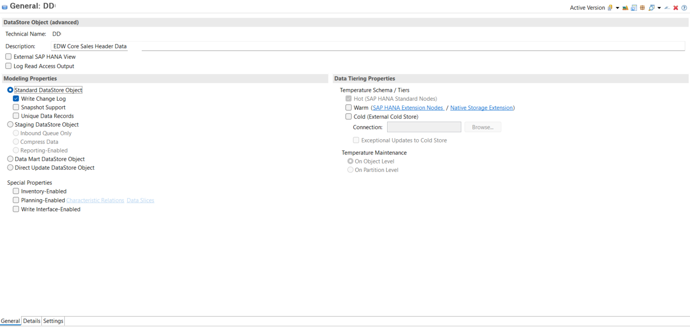

---

## Data Warehouse Layer (LSA++)

### BW/4HANA Modeling

- ADSO (Corporate Memory)  
- ADSO (Reporting / Data Mart Layer)  
- Harmonized InfoObjects  
  - Customer  
  - Material  
  - Organization  
  - Time  
  - Units / Currency  

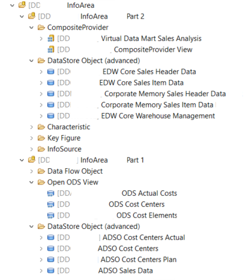

---

## Semantic Layer (BW/4HANA)

### CompositeProvider

- Logical join of Sales Header & Item  
- Harmonized Key Figures  
- BW Query ready structure  

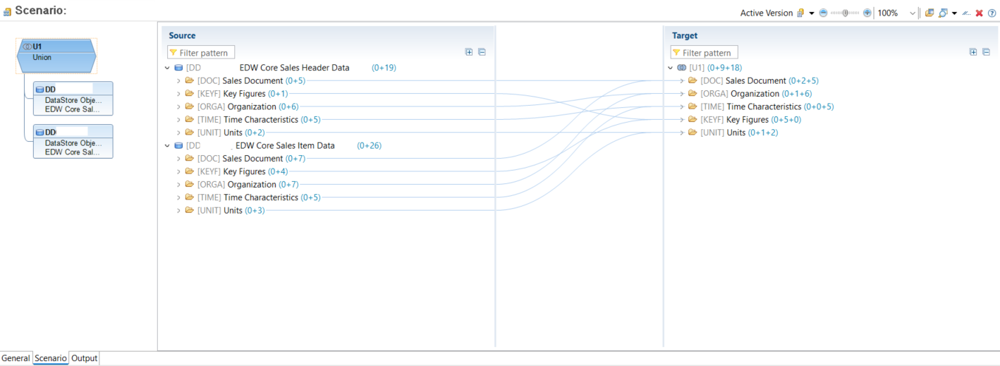

---

## SAP HANA Semantic Layer

### Calculation View (Star Join Model)

- Fact: Sales (Header + Item)  
- Dimensions: Customer, Material  
- SQL/Semantic Consumption Ready  

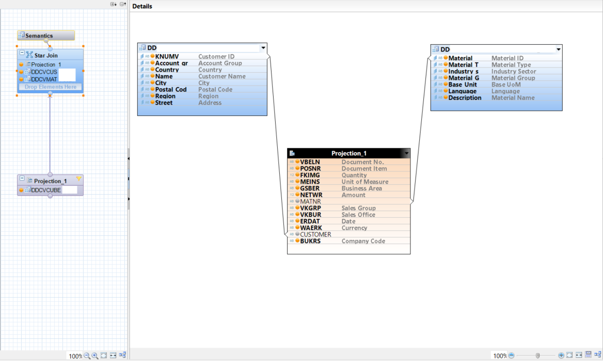

---

## SAP Datasphere – Data Ingestion

### Replication Flow

Data replicated from BW/HANA into Datasphere:

- Sales Header → Local Table  
- Sales Item → Local Table  
- Customer Master → Local Table  
- Material Master → Local Table  

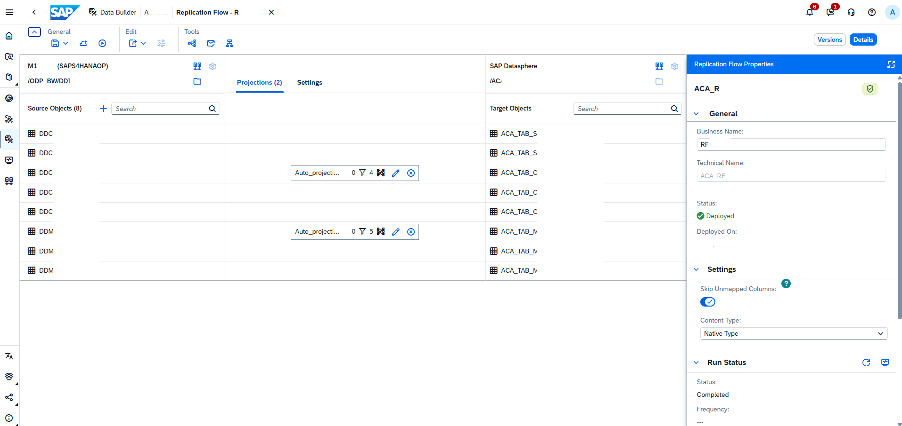

---

## SAP Datasphere – Modeling

### Fact View (Sales)

- Join Header + Item  
- Filters & Calculations  
- Sales Fact structure  

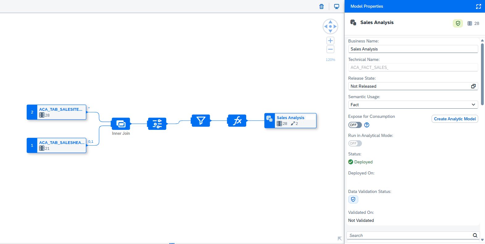

---

### Customer Dimension

- Master Data Modeling  
- Key & Text Attributes  

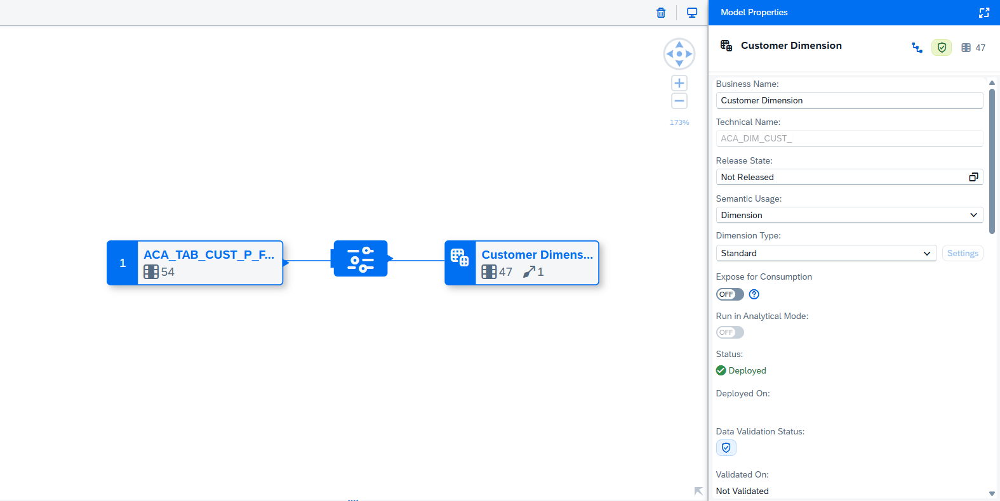

---

## SAP Datasphere – Analytics Layer

### Analytic Model (Sales Analysis)

Includes:

- Measures: Net Value, Cost, Margin  
- Associations: Customer, Material  
- Ready for consumption  

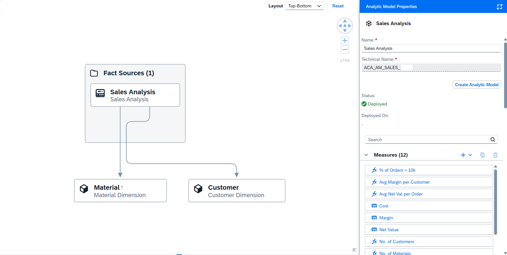

---

## Reporting & Validation

### BW Query Preview

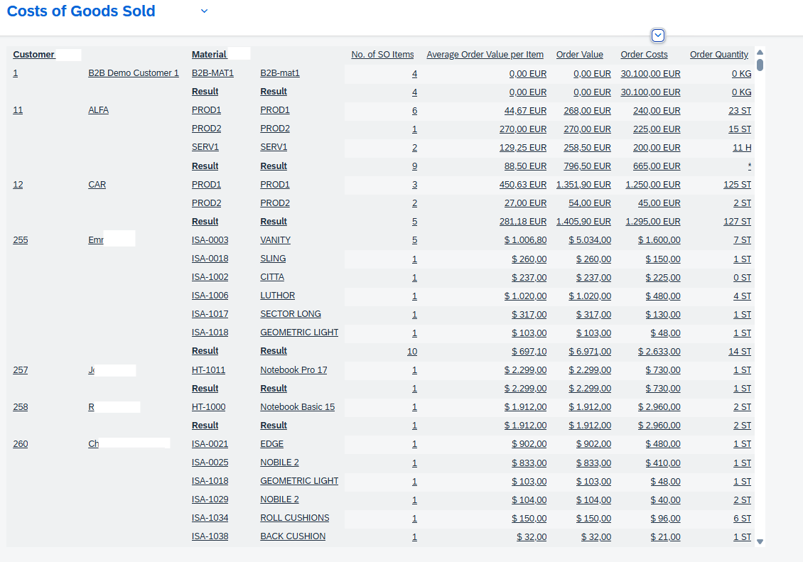

Ensures reconcili
