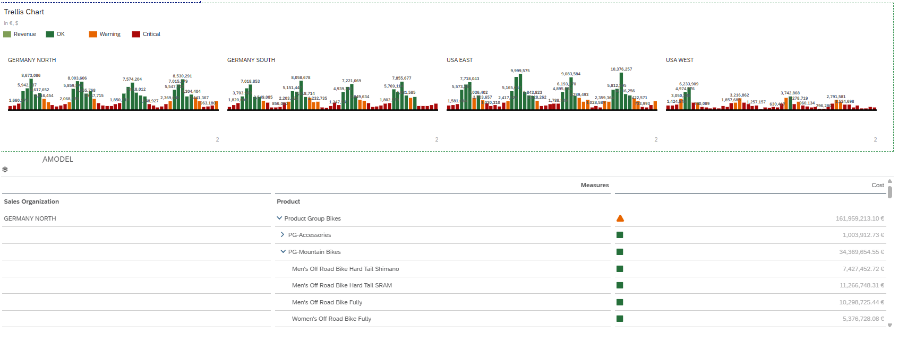
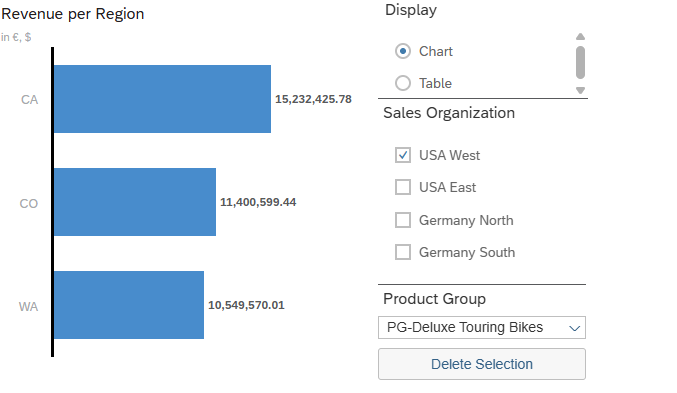

# SAP Analytics Portfolio

SAP Analytics Cloud (SAC) | SAP BW/4HANA | Integrated Planning

This portfolio showcases end-to-end SAP Analytics implementations covering executive reporting, integrated planning, and predictive modeling using SAP Analytics Cloud and SAP BW/4HANA.

The solutions simulate enterprise-grade analytics scenarios and demonstrate practical configuration, modeling, and business-driven dashboard development.

---

## Portfolio Objective

To design and implement business-driven analytics and planning solutions using SAP Analytics Cloud and SAP BW/4HANA, following enterprise modeling standards and best practices.

Focus areas include:

- Executive Sales Performance Reporting
- Contribution Margin Analytics
- Integrated Sales Planning & Forecasting
- Predictive Analytics (Regression Modeling)
- Data Actions & Allocation Logic
- Version Management & Variance Analysis
- BW/4HANA Live Connectivity

---

# Project Overview

---

## 1️⃣ Sales Performance Analytics  
**SAC Story + SAP BW/4HANA Live Connection**

This solution focuses on delivering executive-level performance transparency with drill-down capability, KPI-driven monitoring, and real-time BW live integration.

🔹 Revenue & Quantity performance analysis  
🔹 Regional breakdown (Germany / USA)  
🔹 Product & customer drill-down  
🔹 KPI conditional formatting  
🔹 Trellis regional comparison  
🔹 Geo analytics integration  
🔹 Analytic application with dynamic filtering  

### Screenshots

---

## 2️⃣ Predictive Analytics – Regression Model  
**SAP Analytics Cloud Smart Predict**

This implementation demonstrates regression-based predictive modeling and statistical validation within SAP Analytics Cloud Smart Predict.

🔹 Dataset preparation and feature structuring  
🔹 Linear regression modeling  
🔹 Training vs validation partitioning  
🔹 RMSE evaluation  
🔹 Prediction confidence analysis  
🔹 Influencer contribution ranking  
🔹 Predicted vs actual comparison  
🔹 Feature category impact analysis  

### Screenshots

---

# Core Skills & Technologies

### SAP Analytics Cloud
- Story Design & Advanced Layouts
- Analytic Applications
- Smart Predict (Regression)
- Planning Models & Version Control
- Data Actions & Multi Actions
- Allocations & Driver-Based Logic
- KPI Modeling & Restricted Measures

### SAP BW/4HANA
- Live Data Connectivity
- Analytical Data Modeling
- Aggregation Logic

### Business Competencies
- Executive Reporting
- Forecasting & Scenario Planning
- Variance Analysis
- Performance Management Design

---

## Author

Md Ali Awlad  
SAP Analytics & Planning Portfolio

---

## Acknowledgment

The projects were implemented in an SAP Analytics Cloud training environment provided by ERP4Students for educational purposes.

All business cases are based on simulated enterprise scenarios.

